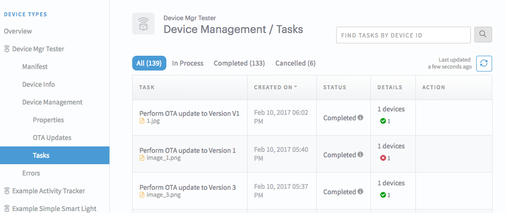

# LWM2M client performing OTA firmware update

This sample is java LWM2M client application. It acts on the OTA (Over The Air) firmware update triggered by manual operations in Device Management dashboard in ARTIK Cloud.

After completing this sample, you will learn the following objectives:

- Use Device Management page of Deverloper Dashboard to [upload a firmware image](https://developer.artik.cloud/documentation/advanced-features/ota-updates.html#upload-and-manage-images) and [trigger an OTA firmware update](https://developer.artik.cloud/documentation/advanced-features/ota-updates.html#execute-ota-update) to your end device.
- Implement an LWM2M client based on [ARTIK Cloud LWM2M Java SDK](https://github.com/artikcloud/artikcloud-lwm2m-java). The client can perform the OTA firmware update triggered by ARTIK Cloud.

## Requirements
- ARTIK Cloud LWM2M SDK (Java)
- Java version >= 1.8
- Apache Maven 3.0.5 or above

## Overview of workflows
- Create a device type in Developer Dashboard and enable Device Management for that device type.    
- Add a device of that type to your account in My ARTIK Cloud. Note the device ID and token.
- Run the SampleApp (lwm2m client) and provide the device ID and token. This will create a connection to ARTIK Cloud and wait for a firmware update.
- In ARTIK Cloud Device Management Dashboard, upload a firmware image, and select the connected device to apply a firmware update.
- Watch the logs of the lwm2m client to observe the firmware update.

## Setup / Installation

### Setup at ARTIK Cloud

 1. [Create a device type](https://developer.artik.cloud/documentation/tools/web-tools.html#creating-a-device-type) (or use the one you already own) in  the [Developer Dashboard](https://developer.artik.cloud/).   

 2. Enable [Device Properties](https://developer.artik.cloud/documentation/advanced-features/device-management.html#device-management-in-the-developer-dashboard) for your device type. You do this in the [Device Type Dashboard](https://developer.artik.cloud/dashboard/devicetypes)—> Select Your Device Type —> Select Device Management —> Click "Enable Device Properties".

 3. At [My ARTIK Cloud](https://my.artik.cloud/), [connect a device](https://developer.artik.cloud/documentation/tools/web-tools.html#connecting-a-device) (or use the one you already own) of the device type. Get the [device ID and token](https://developer.artik.cloud/documentation/tools/web-tools.html#managing-a-device-token), which you will need when running the example client later.

### Setup the Java project

 1. Clone this sample application if you haven't already done so.

 2. Follow the installation instructions of the [ARTIK Cloud LWM2M Java SDK](https://github.com/artikcloud/artikcloud-lwm2m-java) to install SDK libraries in your local maven repository. *Please note that this SDK is different from the [ARTIK Cloud Java SDK](https://github.com/artikcloud/artikcloud-java).*
 
 3. Run the following build command at the top of the source directory:

  ~~~shell
  mvn clean package
  ~~~

  The executable `ota-lwm2m-client-x.x.jar` is generated under the target directory.

## Play with firmware update

Are you ready to have fun? 

 1. Start lwm2m client. Run the following command at the top of the source directory:
  ~~~shell
  java -jar target/ota-lwm2m-client-x.x.jar -d YOUR_DEVICE_ID -t YOUR_DEVICE_TOKEN -f FIRMWARE_VER_AFTER_UPDATE
  ~~~
  **NOTE** You provide the device ID, token and firmware version as an input arguments. *In the real world scenario, the lwm2m device should obtain the firmware version from the installed firmware image.* From the terminal print out, you should see that the client establishes a connection to ARTIK Cloud LWM2M server and is now waiting to receive an Over The Air firmware update from the server.
 
 2. Go to Developer Dashboard to [upload a Firmware image](https://developer.artik.cloud/documentation/advanced-features/ota-updates.html) for your Device Type. You can select any type of files (e.g. txt) as an image. In the [firmware image metadata screen](https://developer.artik.cloud/documentation/advanced-features/ota-updates.html#firmware-image-metadata),  enter the following information: 
     - Choose "Application" as an [update type](https://developer.artik.cloud/documentation/advanced-features/ota-updates.html#execute-ota-update).
     - **Set "version number" to the one you provide in the command line at Step 1.**

 3. [Execute an Firmware Update](https://developer.artik.cloud/documentation/advanced-features/ota-updates.html#execute-ota-update) using the Device Management dashboard.

 4. In the terminal of the sample app, you will see the logs similar to the following:
  ```shell
  >>>downloadPackage(String packageUri).
     Image url:https://api.artik.cloud/v1.1/updates/urls/ed26b48d9
  >>>Downloading firmware...
     Content-Type = application/octet-stream
     Content-Disposition = null
     Content-Length = 81292
  >>>Downloading complete and save to ./firmware_V1
  >>>executeUpdateFirmware()
  >>>simulate updating ...
  >>>simulate updating complete with version V1
  ```

 5. You will find the downloaded firmware file under the current directory. Enter Ctrl-C in the terminal to kill the client. This sample client is good to use for one update.

 6. Go to Developer Dashboard to [monitor OTA update tasks](https://developer.artik.cloud/documentation/advanced-features/ota-updates.html#monitor-update-task). You should see one task for each run of this client like the following screenshot. An update could fail due to various reasons. For example, the versions provided in Step 1 and 2 do not match.


## Implementation

To implement the lwm2m client that can perform firmware via ARTIK Cloud, you just need to override the following two methods of the FirmwareUpdate class. This follows the LWM2M Specifications for Object 5 FirmwareUpdate Resources.

 - downloadPackage(String packageUri)
 - executeUpdateFirmware()

   ```java
   //SampleApp.java 
   FirmwareUpdate sampleFirmwareUpdate = new FirmwareUpdate() {

     @Override
     public FirmwareUpdateResult downloadPackage(String packageUri) {
       System.out.println("\n" + ">>>downloadPackage(String packageUri)." + "\n" + "   Image url:" + packageUri);
       // ... url to your image is provided in the packageURI. 
       try {
           System.out.println(">>>Downloading firmware...");
           downloadFile(packageUri, saveFirmwarePath);
       } catch (IOException exc) {
           // Something went wrong when downloading
           return FirmwareUpdateResult.OUT_OF_MEMORY; // an example of failures
       }
       //returning success here puts FirmwareUpdate State to "Downloaded".
       return FirmwareUpdateResult.SUCCESS;
     }

     @Override
     public FirmwareUpdateResult executeUpdateFirmware() {
       System.out.println(">>>executeUpdateFirmware()");
       // ... update the firmware and set to new version.
       // version here should match the image version you provided in ARTIK Cloud Developer Dashboard
       // to see a successful status
       device.setFirmwareVersion(FINAL_FIRMWARE_VERSION, true);

       return FirmwareUpdateResult.SUCCESS;
       // Something went wrong during installing new firmware
       //return FirmwareUpdateResult.FAILED; // an example of failures
     }
   };
   ```

Check out our documentation for more OTA (Over the Air) Updates [OTA documentation](https://developer.artik.cloud/documentation/advanced-features/ota-updates.html).

## Resources

### Referenced Code Samples / Documentation

| Description                     | Type          | Source                                   |
| ------------------------------- | ------------- | ---------------------------------------- |
| ARTIK Cloud LWM2M Client (Java) | Code/  SDK    | https://github.com/artikcloud/artikcloud-lwm2m-java |
| ARTIK Cloud LWM2M Client (C)    | Code / SDK    | https://github.com/artikcloud/artikcloud-lwm2m-c |
| ARTIK Cloud Java SDK                 | Code / SDK    | https://github.com/artikcloud/artikcloud-java |
| Documentation: LWM2M            | Documentation | https://developer.artik.cloud/documentation/advanced-features/manage-devices-using-lwm2m.html |
| How to enable device managment | Documentation     | https://developer.artik.cloud/documentation/advanced-features/device-management.html#device-management-in-the-developer-dashboard |
| OTA Updates                     | Documenation  | https://developer.artik.cloud/documentation/advanced-features/ota-updates.html |
| My ARTIK cloud                   | Dashboard     | https://my.artik.cloud                   |
| Developer Dashboard            | Dashboard     | https://developer.artik.cloud/dashboard  |


More about ARTIK Cloud
----------------------

If you are not familiar with ARTIK Cloud, we have extensive documentation at https://developer.artik.cloud/documentation

The full ARTIK Cloud API specification can be found at https://developer.artik.cloud/documentation/api-reference/

Check out advanced sample applications at https://developer.artik.cloud/documentation/samples/

To create and manage your services and devices on ARTIK Cloud, create an account at https://developer.artik.cloud

Also see the ARTIK Cloud blog for tutorials, updates, and more: http://artik.io/blog/cloud


License and Copyright
---------------------

Licensed under the Apache License. See [LICENSE](LICENSE).

Copyright (c) 2017 Samsung Electronics Co., Ltd.
